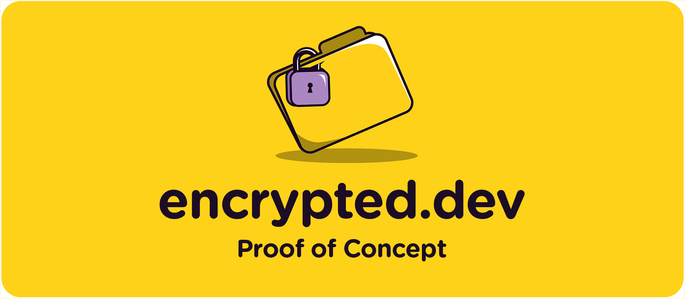
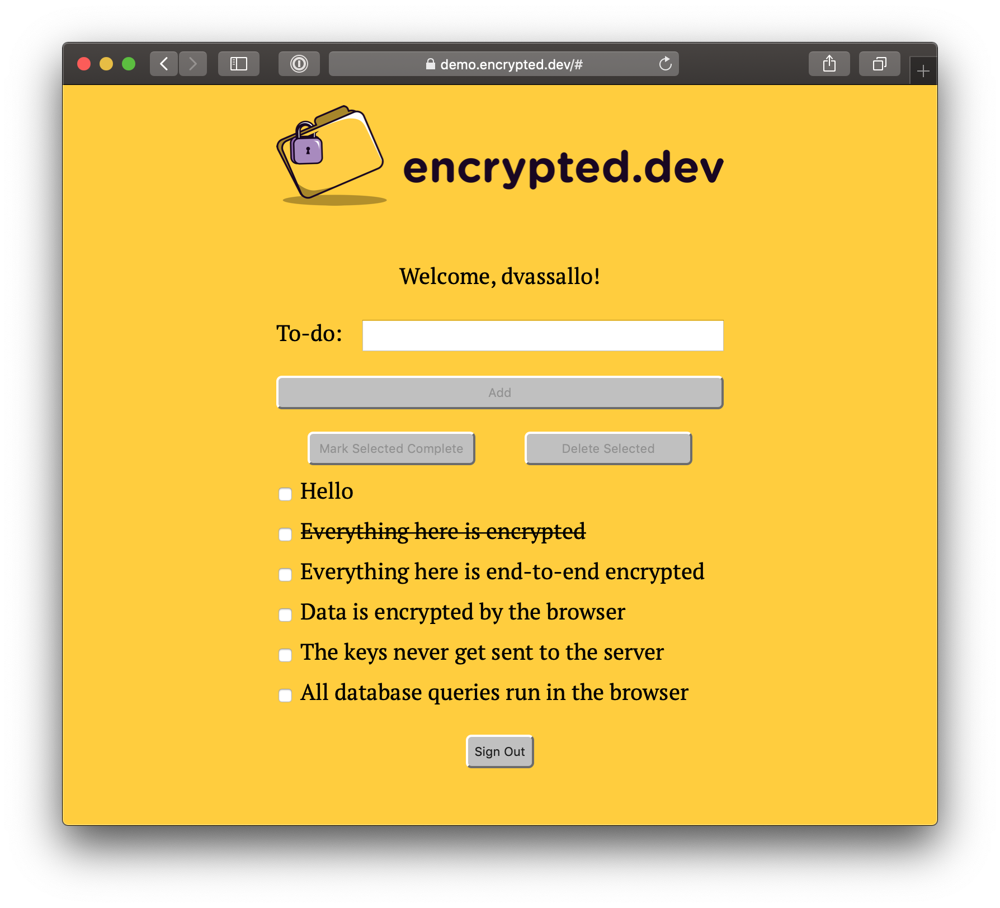

[](https://encrypted.dev)

This is a simple to-do web app with a twist: All user data is **end-to-end encrypted**.

Every to-do item gets encrypted by the browser with a secret key that never goes to the server. The user gets data privacy, while the app developer gets spared the liability of user data. A win-win.

For now, this is just a prototype app. It's a proof of concept to demonstrate that web apps like this can work and perform adequately without server-side database queries. With end-to-end encryption, all database queries must happen in the browser. The server is there just to handle access control and store the encrypted data.

## Demo

Here's a demo you can try right now: https://demo.encrypted.dev. The point of the demo is that it should feel indistinguishable from a regular web app, despite the fact that all database queries are running over encrypted data, and in the browser.

<p align="center">
  <a href="https://demo.encrypted.dev"></a>
</p>

## Performance

A major focus of the proof of concept was on performance. The repo includes 3 load tests that set up the app with 1K, 10K, and 100K to-do items. On a 2.9 GHz i9 MacBook Pro with 100 Mbps network, the app was able to fetch and decrypt 1K items in 0.3s, 10K in 0.8s, and 100K in 6.4s. Once the app had loaded the data, querying it was nearly instantaneous.

Performance is still an area under development, and more results will be published soon. You can also run the perf tests yourself by following [these instructions](docs/perftest.md).

## What's Next?

A framework will be extracted from this prototype to help anyone build web and mobile apps with end-to-end encrypted user data. The framework will be 100% open source and MIT licensed. If you want to keep up to date with its progress you can [subscribe to the mailing list](https://updates.encrypted.dev/subscribe). (No more than one or two emails a month.) You can also [follow on Twitter](https://twitter.com/dvassallo) for more frequent updates.

There are still a few things being explored that haven't been validated by this proof of concept yet:

- Data sharing across users.
- Secret key rotation or revocation.
- Real-time live queries and push notifications.
- Other ways of distributing the secret key across devices (beyond copy/pasting).

## Development

Running this app requires an AWS account. You just need to provide your AWS credentials and the app will automatically create all the AWS resources it needs: 3 DynamoDB tables with per-request billing, and 1 S3 bucket. To run the app locally, put your AWS credentials in `~/.aws/credentials` under a profile called `encrypted`:

```
echo "
[encrypted]
aws_access_key_id=<YOUR ACCESS KEY>
aws_secret_access_key=<YOUR SECRET KEY>" >> ~/.aws/credentials
```

Check out the repo:

```
git clone https://github.com/encrypted-dev/proof-of-concept.git
```

Install the dependencies:

```
npm install
```

Start the dev server:

```
npm start
```

Go to http://localhost:3000 and you should see the sign in screen.

## License

This project is released under the [MIT License](LICENSE).
