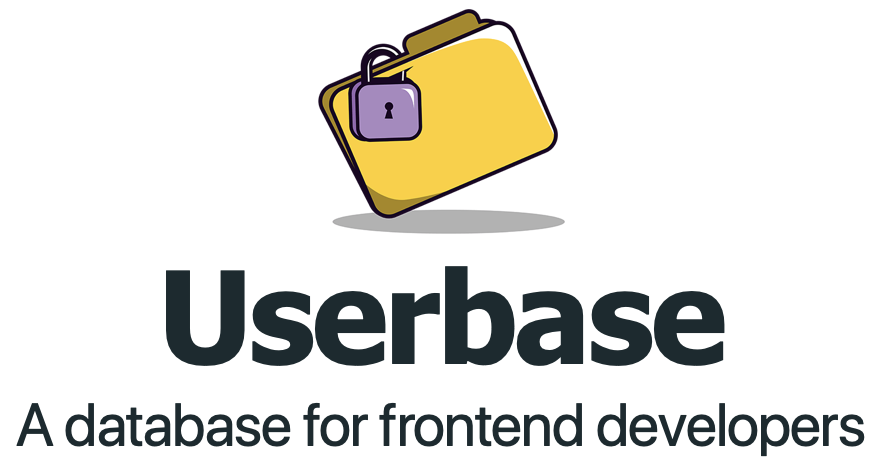

<p align="center">
  <a href="https://userbase.com"></a>
</p>

<p align="center">
<b>Create secure and private web apps using only static JavaScript, HTML, and CSS.</b>
</p>

## What is Userbase?

Userbase is the easiest way to add user accounts and user data persistence to your static site. All Userbase features are accessible through a very simple [JavaScript SDK](https://userbase.com/docs/sdk/), directly from the browser. No backend necessary.

### Built-in user accounts
Userbase takes care of your user accounts. The Userbase SDK lets you sign up, login, and logout users directly from your static site.

### Zero-management database
Instead of sending database queries to a server, Userbase sends the user's data to the browser. Queries happen client-side, and there is nothing on the backend to manage or worry about.

### End-to-end encryption
Userbase encrypts all database operations in the browser with user-controlled keys. This helps you prevent personal data misuse, and lets you offer a high level of data privacy.

### Open source
Userbase is 100% open source, MIT licensed. You can host it yourself always under your control, or [we can run it for you](https://userbase.com/pricing/) for a full serverless experience.

## When would I use it?
If you're building a web app, you will likely need a database and a backend. Userbase can replace both of those things...

- If you want to build a web app without writing any backend code.
- If you want secure authentication out of the box.
- If you want to store user data securely.
- If you want to radically simplify your GDPR compliance.
- And if you want to keep things really simple.

Check out the [FAQ](https://userbase.com/docs/faq/) for more details.

## How do I start?
The easiest way to start using Userbase is to follow our [Quickstart](https://userbase.com/docs/) guide. If you have any questions, or if there's anything we can do to help you with your web app, please [get in touch](https://userbase.com/contact/). Thank you!

## Development

<i>This section is for those who want to host the Userbase stack themselves. For the full serverless experience, head over to our [Quickstart](https://userbase.com/docs/) guide to get started.</i>

### Configure the AWS credentials
Running the Userbase server requires an AWS account. You just need to provide your AWS credentials and the server will automatically create all the AWS resources it needs. To run the app locally, simply put your AWS credentials in `~/.aws/credentials` under a profile called `encrypted`:

```
echo "
[encrypted]
aws_access_key_id=<YOUR ACCESS KEY>
aws_secret_access_key=<YOUR SECRET KEY>" >> ~/.aws/credentials
```

### Check out the repo

```
git clone https://github.com/encrypted-dev/userbase.git
```

### Install the dependencies

#### Mac/Linux
```
npm install
```

#### Windows WSL

To bypass symlink issues on Windows, you need to disable symlinks on WSL. For more info, check WSL issues [#14](https://github.com/Microsoft/WSL/issues/14) and [#26](https://github.com/MicrosoftDocs/WSL/issues/26).

```
npm install --no-bin-links
```

### Start the dev server

```
npm start
```

Go to http://localhost:3000 and you should see the sign in screen.

### Running tests
We use [Cypress](https://www.cypress.io/) to run tests, all the test files are under the ./cypress dir.

```
npm run test
```

## Credits
The people who made this project a reality:
- [Daniel Vassallo](https://twitter.com/dvassallo)
- [Justin Berman](https://twitter.com/justinberman95)
- [Luca Cipriani](https://twitter.com/mastrolinux)
- [Tony D'Addeo](https://twitter.com/amdaddeo)

## License

This project is released under the [MIT License](LICENSE).
