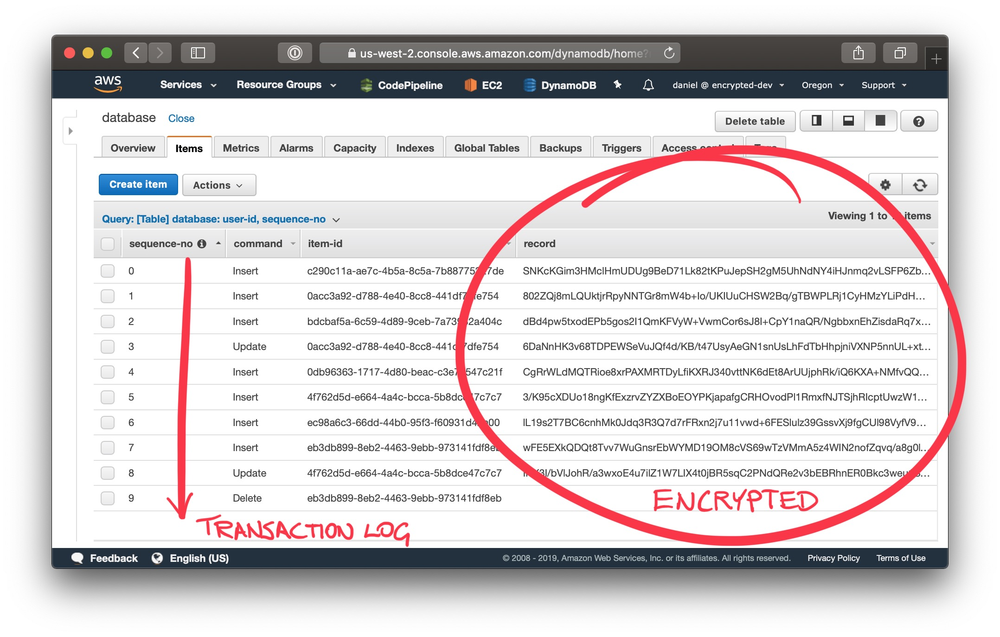

<p align="center">
  <a href="https://userbase.dev"></a>
</p>

Userbase is a database, but purpose-built for web apps. It is accessible directly from the browser through a very simple JavaScript SDK.

## What does it do?

Userbase becomes your database, as well as your backend. You can create fully dynamic web apps using only static JavaScript, HTML, and CSS. No backend code necessary.

### Zero management
Unlike a regular database, all Userbase queries run in the browser, with the server-side acting as a dumb data store. There's no database to manage or worry about.

### Built-in user management
Unlike a regular database, Userbase takes care of your user accounts. It comes with built-in APIs for user signups, logins, and access control.

### End-to-end encrypted
Userbase won't show you what your users store in your web app. Yes, that's a feature — maybe the most important feature. Userbase spares you from the liability of handling user data by encrypting everything in the browser, using keys that always stay with the user.

## When would I use it?
If you're building a web app, you will likely need a database. Userbase can replace your database...

- If you want to build a web app without writing any backend code.
- If you never want to see your users' data.
- If you're tired of dealing with databases.
- If you want to radically simplify your GDPR compliance.
- And if you want to keep things really simple.

## How do I start?
Userbase will be available around mid-December 2019. You can [subscribe to the mailing list](https://userbase.dev/mailing-list) to keep up to date.

## Demo

This is a simple to-do web app with a twist: All user data is **end-to-end encrypted**.

Every to-do item gets encrypted by the browser with a secret key that never goes to the server. The user gets data privacy, while the app developer gets spared the liability of user data. A win-win.

For now, this is just a prototype app. It's a proof of concept to demonstrate that web apps like this can work and perform adequately without server-side database queries. With end-to-end encryption, all database queries must happen in the browser. The server is there just to handle access control and store the encrypted data.

The point of the demo is that it should feel indistinguishable from a regular web app, despite the fact that all database queries are running over encrypted data, and in the browser.

Give it a go, and judge for yourself: **https://demo.encrypted.dev**

<p align="center">
  <a href="https://demo.encrypted.dev"></a>
</p>

This is how the data for that view got stored:

<p align="center">
  
</p>

The `update` at seq #3 was to mark item #2 as complete. The `update` at seq #8 was to put the 🔑 emoji in item #5. And the `delete` in seq #9 was to delete an item inserted at seq #7 (which doesn't show in the app anymore).

Whenever the browser runs a database query, it asks the server for any new transactions since the last seq # it had seen, and then it applies any new transactions to its store. The browser will also periodically compact the transaction log and re-upload it to the server — encrypted, obviously. This allows updates and deletes to get squashed whenever the transaction log reaches a certain size.

## Performance

A major focus of the proof of concept was on performance. On a 2.9 GHz i9 MacBook Pro with 100 Mbps network, the app was able to fetch and decrypt 1K items in 0.3s, 10K in 0.8s, and 100K in 6.4s. Once the app had loaded the data, querying it was nearly instantaneous.

## Development

### Setting up AWS Keys
Running this app requires an AWS account with an Access Key. To create one, you can follow the guide on [AWS Blog](https://aws.amazon.com/blogs/security/how-to-find-update-access-keys-password-mfa-aws-management-console/)
You just need to provide your AWS credentials and the app will automatically create all the AWS resources it needs: 3 DynamoDB tables with per-request billing, and 1 S3 bucket. To run the app locally, put your AWS credentials in `~/.aws/credentials` under a profile called `encrypted`:

```
echo "
[encrypted]
aws_access_key_id=<YOUR ACCESS KEY>
aws_secret_access_key=<YOUR SECRET KEY>" >> ~/.aws/credentials
```

### Check out the repo

```
git clone https://github.com/encrypted-dev/userbase.git
```

### Install the dependencies

#### Windows WSL

To bypass symlink issues we have to disable symlinks on WSL, more info available at: https://github.com/MicrosoftDocs/WSL/issues/26
and https://github.com/Microsoft/WSL/issues/14

```
npm install --no-bin-links
```

#### Mac/Linux
```
npm install
```

### Start the dev server

```
npm start
```

Go to http://localhost:3000 and you should see the sign in screen.

## Who's behind this?
This product is the work of [Daniel Vassallo](https://twitter.com/dvassallo) and [Justin Berman](https://twitter.com/justinberman95). If you have any questions, or there's anything we can do to help you with your web app, please [get in touch](daniel@encrypted.dev). Thank you!

## License

This project is released under the [MIT License](LICENSE).
