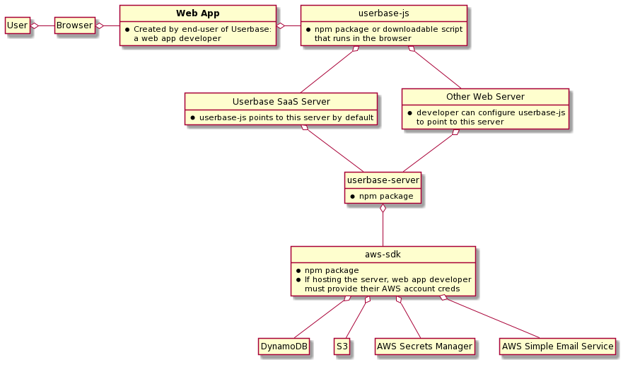
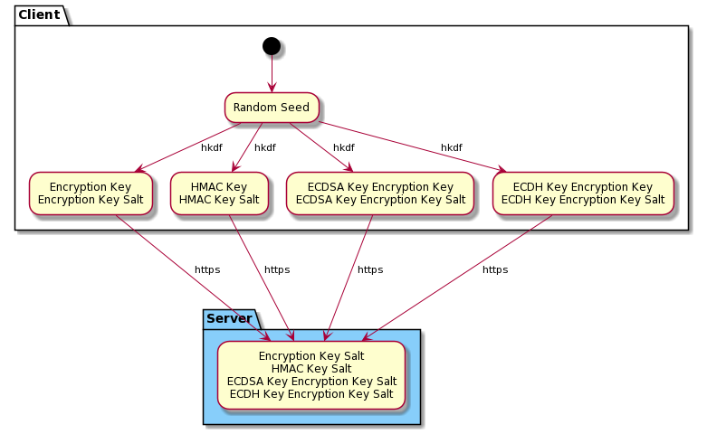
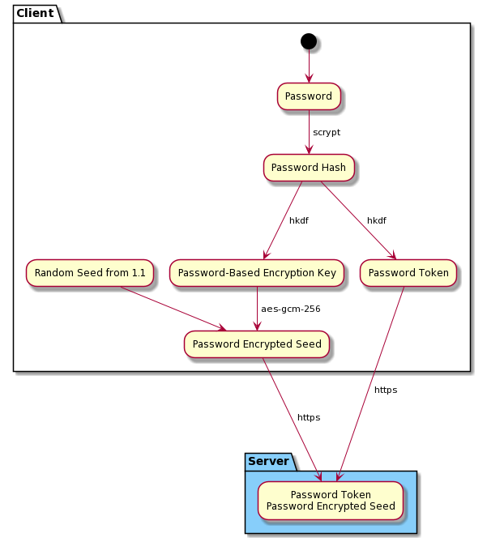
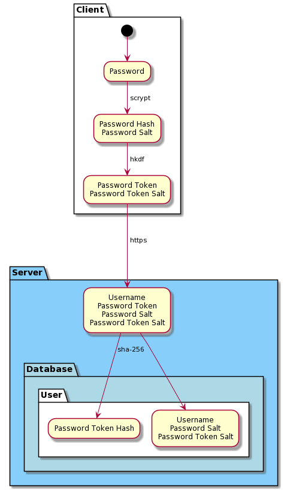
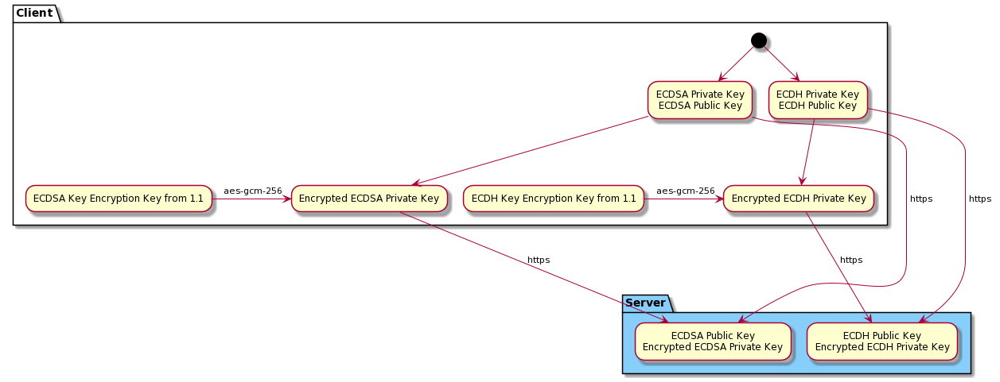
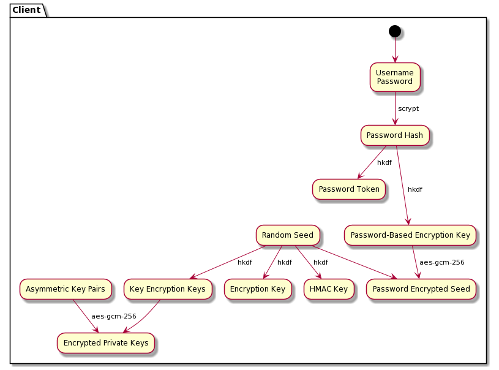
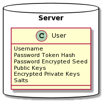
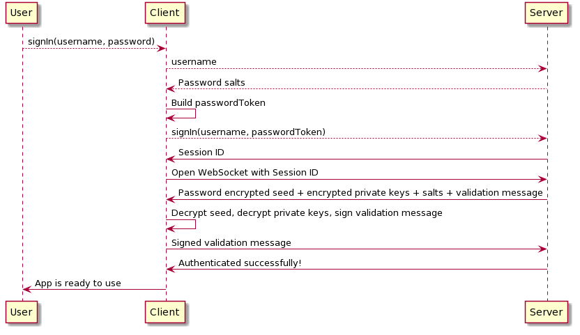
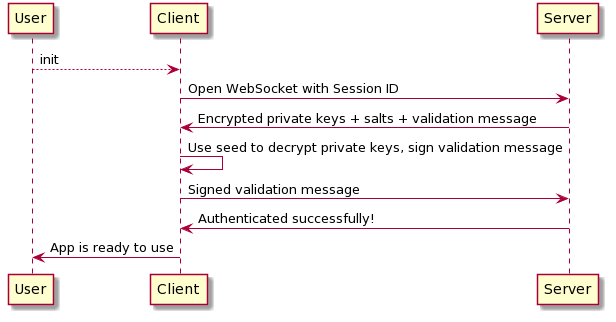
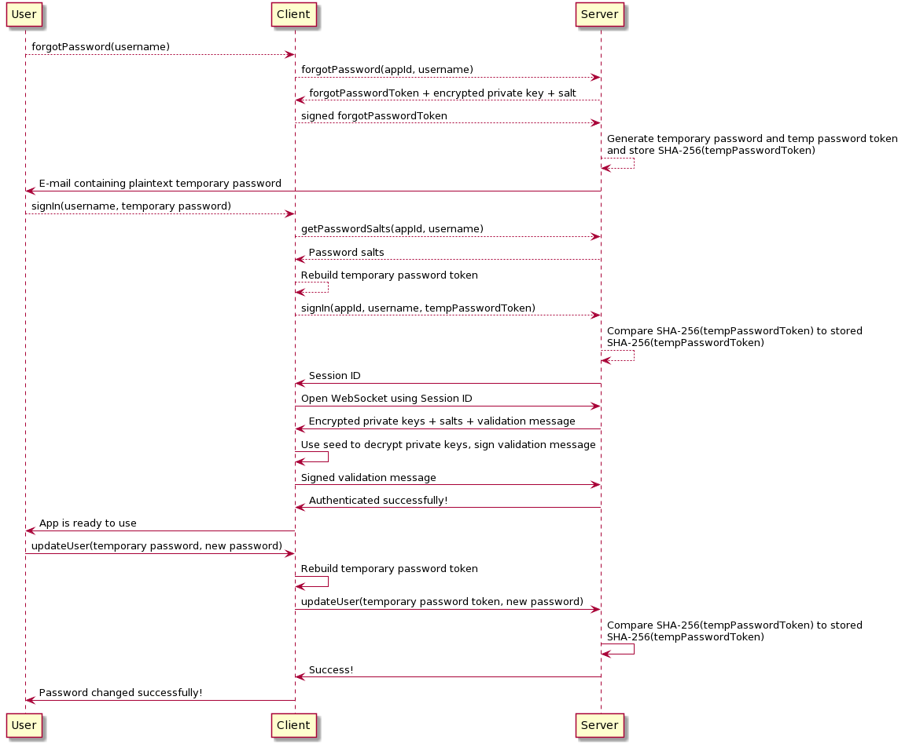

<p align="center">
  <a href="https://userbase.com"></a>
</p>

<p align="center" >
  <i>August 2020</i>
</p>

# Intro

[Userbase](https://userbase.com) is the easiest way to create secure and private web applications. Userbase offers built-in user accounts and authentication, an end-to-end encrypted zero-management database and file storage solution, and a way to accept subscription payments. All Userbase features are accessible through a very simple open source [Javascript SDK](https://userbase.com/docs/sdk/), directly from the browser. No backend necessary - Userbase manages the backend for you, and no one with access to the Userbase backend can access your users’ data.

This document describes Userbase’s design roughly following the [4+1 architectural view model](https://en.wikipedia.org/wiki/4%2B1_architectural_view_model).

- [1 - Logical View](#1---Logical-View)
- [2 - Process View](#2---Process-View)
- [3 - Development View](#3---Development-View)
- [4 - Physical View](#4---Physical-View)
- [+1 - Scenarios](#+1---Scenarios)


# 1 - Logical View
<i>"The logical view is concerned with the functionality that the system provides to end-users."</i>

Userbase is a SaaS product web app developers use to store encrypted user data in the cloud, enable users to share encrypted data with other users, manage user authentication, and accept subscription payments. Developers access Userbase through a simple Javascript SDK called userbase-js. Userbase developers do not need to run a backend server, however, they can choose to if they want -- Userbase’s backend code is also <a href="../src/userbase-server">open source</a>.

<br>
<p align="center">
  
</p>
</br>

# 2 - Process View
<i>"The process view deals with the dynamic aspects of the system, explains the system processes and how they communicate, and focuses on the run time behavior of the system. The process view addresses concurrency, distribution, integrator, performance, and scalability, etc."</i>

- [Creating a Database](#Creating-a-Database)
- [Transactions](#Transactions)
- [Bundling](#Bundling)
- [Opening a Database](#Opening-a-Database)
- [File Storage](#File-Storage)
- [Database Sharing](#Database-Sharing)
- [Verifying Users](#Verifying-Users)
- [Subscription Payments](#Subscription-Payments)
- [Purging Data](#Purging-Data)
- [Metering Data](#Metering-Data)

## Creating a Database

When a user is signed in, the user can create a new database. A user can create as many databases as they want. The creator of a database becomes its owner by default. Only the owner of a database can read from or write to a database, unless the owner shares the database with other users and grants write privileges to those users.

On the server-side, the database is partitioned from other databases created by other users. This means read/write performance of a single database does not directly impact other databases. As such, Userbase scales horizontally where each server is partitioned by clusters of users accessing different databases.

A user must provide a unique name for all their newly created databases -- each user has their own namespace. If a single user of a particular application attempts to create two databases with the same name at the same time, only one creates successfully.

## Transactions

Items are the most granular unit inside a database. Each database is composed of an array of items, each with a unique item ID. Each write operation to create, update, or delete items inside a database is referred to as a "transaction".

When writing data to a database, a developer can call the insertItem, updateItem, deleteItem, or putTransaction functions exposed in userbase-js. putTransaction allows developers to group the preceding three functions into an atomic batch of commands. The insert and update functions encrypt the item provided. All four functions send a single transaction to the server to append to a database’s "transaction log". The concept of the transaction log is not exposed to Userbase developers -- it’s an internal concept integral to the design of the Userbase system.

When the server receives a transaction, the server atomically increments a sequence number associated with that database, and then appends the transaction to the database’s transaction log in DynamoDB. If a user attempts two transactions at the same time, each transaction is assigned distinct sequence numbers. If a transaction inserts successfully, the transaction is then broadcast to all users connected to that database, along with the transaction’s associated sequence number. The client uses the sequence number to ensure transactions are applied to its local state of the database in the correct order.

In applying the transaction, the client ensures the transaction does not violate a uniqueness constraint or conflict with other transactions. After applying the transaction, the client then passes the updated state of the database (the array of items in the database) to a callback function provided by the web app developer. Importantly, all items in a single database must fit in memory on the user’s machine.

## Bundling

When a user's transaction log exceeds a fixed size, the client squashes all transactions in the log, encrypts the state of all items in the database, then sends this encrypted state to the server to upload to S3. We refer to this process as "bundling" and to the encrypted state as a "bundle." The client notes the sequence number of the last transaction included in the bundle referred to as the "bundle sequence number", and sends this to the server as well. The server uses the database ID and bundle sequence number as the file name in S3. If two clients bundle at the same time at the exact same sequence number, the clients must be uploading the same bundle, because transactions are applied in order of their sequence number as described in ["Transactions"](#Transactions). Thus, it is ok if one overwrites the other because the data is the same.

This process happens unbeknownst to developers and users alike -- the client does it automatically in the background.

## Opening a Database

When opening a database, the client queries for all data contained in that database. The server sends the client the latest encrypted bundle if one is present, and all remaining transactions in the log after the bundling process took place. This way the client can decrypt a large blob and then apply a much smaller set of transactions to this blob to rebuild the state of their database, rather than retrieve a large transaction log, decrypt each individual transaction in the log, and then apply each individual transaction to build the state.

To the developer, they simply see an array of items upon opening the database. The developer does not know and does not need to know how the data is retrieved unless they inspect the network tab in their browser.

If two clients attempt to open a database right at the moment a bundling process completes (client 1 receives a bundle at lower sequence number, and client 2 receives a bundle at a higher sequence number), both clients receive the same set of transactions regardless. The server sends all transactions in the log after the bundle sequence number, so client 1 just needs to decrypt and apply more individual transactions to rebuild the state compared to client 2.

Reiterating, all items stored in a single database must fit in memory on the user’s machine.

## File Storage

The uploadFile function exposed in userbase-js essentially attaches a file to an existing item. If a file is already attached to an item, this function overwrites the existing file. Under the hood, it reads the file in chunks of size 512 KB, encrypts each chunk individually, sends each chunk to the server in distinct requests, then the server stores each chunk individually as a distinct file in S3. When there are lots of chunks to upload (i.e. the file is large), the client sends chunks to the server concurrently in batches of 10. There is no size limit to a single file.

Once all of a file’s chunks are successfully written to S3, the client tells the server the upload is complete, at which point the server appends a transaction to the database’s transaction log containing the file ID and other metadata related to the file. This transaction gets broadcast to all users who have the database open, and all users can then use the file ID to read the file. File ID’s are unique identifiers generated by the server.

Developers can use the getFile function exposed in userbase-js to then load entire files into memory, or read byte ranges of files at a time.

## Database Sharing

As stated in ["Creating a Database"](#Creating-a-Database), the owner of a database can choose to share a database with other users. Upon sharing, the owner can choose to give another user write access to the database and the privilege to reshare the database with other users.

In each sharing process, there is a sender and recipient. Under the hood, the sender’s client retrieves the recipient’s public key from the server, and then encrypts the database key such that only the recipient is able to decrypt it. The recipient is then able to decrypt the database key and access the database. Senders and recipients can ensure they are sharing and receiving the database key with the correct user and not a man-in-the-middle by verifying users. This process is described in the next section ["Verifying Users"](#Verifying-Users).

The owner of a database can modify database access permissions for all other users with access to the database. Users who receive privileges to reshare the database and write access can modify permissions of all other users except the owner.

Once the owner of a database deletes a database, or the owner themself is deleted, the database is no longer accessible by any users who have access to the database.

## Verifying Users

Users can prevent man-in-the-middle attacks when sharing databases by verifying other users’ public keys. To get verified, a user calls the getVerificationMessage exposed in userbase-js, then provides the verification message to the verifier either in person (the verifier can scan a QR code containing the message for example), or through a secure 3rd party channel such as [Signal](https://signal.org). The verifier then passes this verification message to their client using the verifyUser function.

When a user shares a database, by default their client requires the recipient to be verified. Of note, usernames are tied to public keys in the verification message. This means that if a user verifies another user but that user changes their username, that user must be reverified.

## Subscription Payments

Developers can connect their Userbase accounts to a Stripe account and accept subscription payments in their apps easily. After connecting, developers tie a single Stripe subscription plan to a Userbase app. Multiple apps can offer the same plan. The purchaseSubscription function exposed by userbase-js then redirects users to a Stripe Checkout form, where users can purchase a subscription via a Stripe-hosted payment page designed to reduce friction.

Developers can offer free trials by setting a trial on their Stripe subscription plan. Free trial users have full privileges until the trial expires. If a trial is not set or is expired, users must pay for a subscription in order to open a database when an app has payments enabled.

Developers can also offer a way for users to cancel or resume their subscriptions using the cancelSubscription or resumeSubscription functions exposed by userbase-js.

Finally, if a user’s credit card fails to charge in a future billing cycle, developers can offer a way for users to change their credit card via the updatePaymentMethod exposed by userbase-js.

## Purging Data

After a user, app, or admin is deleted, all respective data is purged from the Userbase server after 30 days. This includes encrypted data, password hashes, databases, files, etc. The purge process runs nightly between the hours of 1am and 3am PST to minimize disruption to users.

## Metering Data

Userbase meters all raw data stored by admins, apps, users, and databases. Presently Userbase does not have a garbage collector, so raw data can include data that can no longer be referenced or accessed. For example, if a database is bundled multiple times (see the "Bundling" process), a user only needs to access the latest bundle. Userbase does not garbage collect prior bundles, so the metering process still meters all bundles tied to the database.

The metering process runs in the nightly immediately after the purge process completes.

# 3 - Development View
<i>"The development view illustrates a system from a programmer's perspective and is concerned with software management."</i>

Userbase is a monolith. `npm install && npm start` and you are ready to go. The source code is divided into 3 major components: a proof of concept to rapidly test while developing, userbase-js (the Userbase client SDK), and userbase-server. This section also covers other relevant areas of the code including the testing area.

- [Proof of Concept](#Proof-of-Concept)
- [Userbase SDK](#Userbase-SDK)
- [Userbase Server](#Userbase-Server)
- [Userbase SaaS Server](#Userbase-SaaS-Server)
- [Testing](#Testing)
- [Documentation](#Documentation)
- [Samples](#Samples)

## Proof of Concept
<i>[userbase/src/proof-of-concept](../src/proof-of-concept)</i>

The Proof of Concept itself is a monolithic web app comprising both a client and server implementation. We use it to develop and manually test new features rapidly. It also demonstrates how a web app developer can utilize Userbase on both the frontend and backend.

- [/client](../src/proof-of-concept/client)

  Browser-based web application that uses userbase-js.

- [/server](../src/proof-of-concept/server)

  Server implementation that uses userbase-server. Note a developer using Userbase does not have to implement a server since by default, userbase-js points to the Userbase SaaS server.

## Userbase SDK
<i>[userbase/src/userbase-js/src](../src/userbase-js/src)</i>

The client-side Javascript SDK for the browser. Used to interact with a Userbase server. Exposes all functionality a web app developer needs to use the Userbase product.

- [/api](../src/userbase-js/src/api)

  Exposes the few http requests used internally in the SDK to REST endpoints on the Userbase server.

- [/Crypto](../src/userbase-js/src/Crypto)

  userbase-js crypto library containing all cryptographic functions used in the SDK.

- [/errors](../src/userbase-js/src/errors)

  All errors the SDK can throw.

- [/auth.js](../src/userbase-js/src/auth.js)

  Exposes authentication and user-related functions to the developer.

- [/config.js](../src/userbase-js/src/config.js)

  Configuration file that stores default and dynamic configuration options for the SDK. This file is used internally by the SDK.

- [/db.js](../src/userbase-js/src/db.js)

  Exposes database functions to the developer.

- [/localData.js](../src/userbase-js/src/localData.js)

  All functions in the SDK that are used to store or retrieve data in the browser’s local or session storage.

- [/payments.js](../src/userbase-js/src/payments.js)

  Exposes payments related functions to the developer.

- [/ws.js](../src/userbase-js/src/ws.js)

  When a user signs in, a WebSocket connection is established with the Userbase server. This file exports all WebSocket functions and stores data related to each connection in memory (such as a client’s database state).

    - <b>Connection class</b>

      The exported class that stores all WebSocket connection data in memory and exports all functions that utilize the WebSocket.

    - <b>Request function</b>

      Similar to an http request library function that makes a request to the server over the WebSocket and waits for a response.

## Userbase Server
<i>[/userbase/src/userbase-server](../src/userbase-server/)</i>

Serves the backend API to userbase-js. Reads and writes user data to persistent data stores. Multiple machines can run this server at one time safely. Also serves the admin panel, which is its own web application developers use to manage their Userbase account, apps, and users.

- [/admin-panel](../src/userbase-server/admin-panel)

  A browser-based web application that provides a web app developer with an admin panel to manage their Userbase applications. It enables a web app developer to create an app, delete an app, see users of their app, manage users of their app, generate access tokens to the Admin API, manage payments, etc.

- [/crypto](../src/userbase-server/crypto)

  Contains all cryptographic functions used on the server.

- [/admin.js](../src/userbase-server/admin.js)

  Contains all admin functions used internally by the server.

- [/connection.js](../src/userbase-server/connection.js)

  Exposes the DynamoDB client.

- [/db.js](../src/userbase-server/db.js)

  Contains all database functions used internally by the server.

- [/logger.js](../src/userbase-server/logger.js)

  Exposes the pino logger used on the server to log data.

- [/meter.js](../src/userbase-server/meter.js)

  Exposes the metering process that meters all data stored by admins, apps, users, and databases.

- [/nightly.js](../src/userbase-server/nightly.js)

  Exposes the nightly job to purge deleted data and meter data stored.

- [/peers.js](../src/userbase-server/peers.js)

  Contains connected peers running userbase-server. Exposes a function to broadcast transactions received on the server to all other servers running userbase-server.

- [/purge.js](../src/userbase-server/purge.js)

  Exposes the purge process that purges deleted data in the nightly.

- [/responseBuilder.js](../src/userbase-server/responseBuilder.js)

  Exposes helper functions to build the response to userbase-js WebSocket requests.

- [/server.js](../src/userbase-server/server.js)

  Starts the server and exposes all routes available to userbase-js clients (both REST endpoints and routes available over the WebSocket), serves the admin panel web application, serves the Admin API, a Stripe webhook, and REST endpoints for other userbase-server peers.

- [/setup.js](../src/userbase-server/setup.js)

  Called on server start-up to set up all AWS-related processes (e.g. creates DynamoDB tables, creates S3 bucket, pulls in secrets from AWS Secrets Manager etc.), and kick off the interval to run the nightly.

- [/stripe.js](../src/userbase-server/stripe.js)

  Exposes all functions used to handle Stripe subscriptions and connected accounts.

- [/user.js](../src/userbase-server/user.js)

  Exposes all user functions used internally by the server including authentication.

- [/ws.js](../src/userbase-server/ws.js)

  Stores all necessary server-side WebSocket connection data in memory and exports WebSocket functions. Keeps track of user and database connections.

## Userbase SaaS Server

The production server code is in a private repository called userbase-saas. It implements a very basic Node Express server that uses the latest userbase-server npm package.

## Testing

Userbase uses [Cypress](https://www.cypress.io/) for the bulk of tests, as well as a custom testing framework to test real-time browser-to-browser interaction. Cypress tests are located at [/userbase/cypress/integration](../cypress/integration) and the custom testing framework is located at [/userbase/test](../test).

## Documentation

The Userbase homepage is entirely open source and available [here](https://github.com/encrypted-dev/userbase-homepage). It contains all documentation a developer needs to use the Usebase product.

## Samples

Sample applications using the Userbase SDK are available [here](https://github.com/encrypted-dev/userbase-samples).

# 4 - Physical View
<i>"The physical view depicts the system from a system engineer's point of view. It is concerned with the topology of software components on the physical layer as well as the physical connections between these components."</i>

- [Userbase SDK](#Userbase-SDK-1)
  - [userbase-js npm package](#userbase-js-npm-package)
  - [userbase.js script](#userbase.js-script)
- [Userbase Server](#Userbase-Server-1)
- [Userbase SaaS Server](#Userbase-SaaS-Server-1)
- [Logging](#Logging)
- [Monitoring](#Monitoring)
- [Testing](#Testing-1)
- [Documentation](#Documentation-1)
- [Samples](#Samples-1)

## Userbase SDK

The userbase-js client SDK is available to use in 2 forms: an npm package or downloadable script. Deployment to both is manually executed.

### userbase-js npm package
Available at: https://www.npmjs.com/package/userbase-js

To deploy the npm package, one must have write access to the userbase-js npm package. The only people with write access are Daniel Vassallo and Justin Berman. Both have 2FA enabled to publish the npm package.

To publish from the command line, cd into the Userbase repo’s root directory. Then run the following 3 commands in order:

```
npm run build:userbase-js:npm
npm run patch:userbase-js:npm
npm run publish:userbase-js:npm
```

The `build` command transpiles the userbase-js code into an optimized browser-friendly npm package. The package exposes both an ES-friendly module in the /userbase-js/lib directory as well as a CJS build in /userbase-js/dist directory.

The `patch` command increments the npm package’s minor version number.

The `publish` command publishes the package to the npm registry.

Web app developers can install the npm package for use in their web applications via the command:

```
npm install userbase-js
```

### userbase.js script
Available at: https://sdk.userbase.com/2/userbase.js

To build the script for deployment, cd into the Userbase repo’s root directory and run the command:

```
npm run build:userbase-js:script
```

This creates the files `./dist/userbase.js` and `./dist/userbase.js.map`. Those files are then uploaded to an AWS S3 bucket.

The script is then available for download at https://sdk.userbase.com.

The domain sdk.userbase.com (managed via AWS Route53) points to a domain hosting an AWS CloudFront CDN distribution, which points to the script stored in S3.

## Userbase Server
Available at: https://www.npmjs.com/package/userbase-server

The server implementation is available to use as an npm package. The only people with write access to the npm package are Daniel Vassallo and Justin Berman. Both have 2FA enabled to publish the npm package.

To publish from the command line, cd into the Userbase repo’s root directory. Then run the following 3 commands in order:

```
npm run build:userbase-server:npm
npm run patch:userbase-server:npm
npm run publish:userbase-server:npm
```

The `build` command transpiles the userbase-server code into native js.

The `patch` command increments the npm package’s minor version number.

The `publish` command publishes the package to the npm registry.

Web app developers can install the npm package for use on their own node/Express server via the command:

```
npm install userbase-server
```

## Userbase SaaS Server

The SaaS production server is hosted on AWS EC2 instances of type C5 large, which sit behind an EC2 elastic load balancer. We can enable auto-scaling to deploy additional instances as needed at any time. To interact with the EC2 instances, one must have access to the Userbase production AWS account.

The server automatically deploys using [AWS CloudFormation](https://aws.amazon.com/cloudformation/) when a developer pushes a commit to the private userbase-saas GitHub repository’s master branch.

The domain v1.userbase.com (managed via Route53) points to the EC2 elastic load balancer, which directs all requests to randomly chosen EC2 instances running userbase-server.

## Logging

Logs are stored for 30 days on the EC2 instances themselves and are searchable via a powerful query language using [AWS CloudWatch](https://aws.amazon.com/cloudwatch/).

## Monitoring

Userbase uses [Checkly](https://www.checklyhq.com/) to monitor uptime across all Userbase services. The Userbase team receives SMS messages if services go down.

## Testing

Userbase uses [Github Actions](https://github.com/features/actions) to automatically run the suite of Cypress tests on each PR to the Userbase master branch. At the time of this writing, this includes around 500 tests across 12 total specs. All tests run in both Chrome and Firefox and specs run in parallel.

## Documentation

Userbase uses [Netlify](https://www.netlify.com/) to automatically deploy the userbase-homepage on pushes to master.

## Samples

Sample applications are deployed with [Vercel](https://vercel.com/) and Netlify.

# +1 - Scenarios
<i>"The description of an architecture is illustrated using a small set of use cases, or scenarios, which become a fifth view. The scenarios describe sequences of interactions between objects and between processes. They are used to identify architectural elements and to illustrate and validate the architecture design. They also serve as a starting point for tests of an architecture prototype."</i>

Note: each scenario contains lower level cryptographic implementation details.

1. [Signing Up](#1-Signing-Up)
    - 1.1 - [Seed Generation](#11---Seed-Generation-(HKDF))
    - 1.2 - [Password-Based Key Derivation](#12---Password-Based-Key-Derivation-(Scrypt))
    - 1.3 - [Asymmetric Key Generation](#13---Asymmetric-Key-Generation-(ECDSA,-ECDH))
2. [Signing In](#2-Signing-In)
3. [Resuming a Session](#3-Resuming-a-Session)
4. [Forgetting a Password](#4-Forgetting-a-Password)
5. [Using a Database](#5-Using-a-Database)
6. [Verifying a User](#6-Verifying-a-User)
7. [Sharing a Database](#7-Sharing-a-Database)

## 1. Signing Up

Developers call the signUp function exposed by userbase-js to create a user account. The only required parameters to the function are a username and password. The only thing a user needs to sign back into Userbase is their username and password.

Fundamentally, the user’s password is the most critical ingredient to Userbase’s end-to-end encryption scheme. At account creation, using the password, the client performs multiple steps to ensure that data stored via Userbase is end-to-end encrypted, data can be shared securely with other users, and items stored in a database can be uniquely identified from the server’s perspective. These steps can be broken down into three subsections: Seed Generation (1.1), Password-Based Key Derivation (1.2), and Asymmetric Key Generation (1.3).

- ### 1.1 - Seed Generation (HKDF)

  When a user creates a new account, the client generates a random seed. The seed is stored in the browser’s session storage in plaintext by default, enabling a user to refresh a page in a web app and continue using the app normally. Developers can configure their clients not to store the seed at all, or to store the seed in local storage.

  The randomly generated seed is input to HKDF and used to derive four distinct keys for data encryption (encryptionKey), authenticated hashing (hmacKey), and key encryption (ecdsaKeyEncryptionKey & ecdhKeyEncryptionKey). The server stores the salts used to generate each distinct key.

<br/>
<p align="center"></p>
<br/>

- ### 1.2 - Password-Based Key Derivation (Scrypt)

  At account creation, the client encrypts the user’s seed using an encryption key derived from the user’s password. The server stores the encrypted seed, which allows the user to sign in with just their password -- the user does not need their seed to sign in so long as they remember their password. The server also never sees the user’s password. Userbase hashes passwords client-side to maximize difficulty for someone with access to the server to crack passwords.

  When creating a new account, the user provides their username and password, then the client hashes the password with Scrypt. The resulting password hash is then input through HKDF to derive both a password token, as well as a password-based encryption key. The password-based encryption key is used to encrypt the user’s randomly generated seed. The password token is used to authenticate the user in future sign ins.

  The client sends the server the salts used to create the password hash, password token, password encrypted seed, as well as the password encrypted seed itself. The server then stores all salts, and hashes the password token with SHA-256 before storage.

<br/>
<p align="center"></p>
<br/>
<p align="center"></p>
<br/>

- ### 1.3 - Asymmetric Key Generation (ECDSA, ECDH)

  At account creation, the client also generates ECDSA and ECDH key pairs. The ECDSA and ECDH private keys are encrypted with the respective key encryption key generated during Seed Generation (1.1). Each encrypted private key is then stored on the server, along with the respective public keys.

  Not pictured below: the client digitally signs the ECDH public key using the ECDSA private key. The server stores this signature as well.

<br/>
<p align="center"></p>
<br/>

Now putting it all together:

<br/>
<p align="center"></p>
<br/>
<p align="center"></p>
<br/>

## 2. Signing In

To sign in, the user provides their username and password. If valid, the client establishes a WebSocket connection with the server. The WebSocket connection is persistent and long-lived, and all messages that pass through it are in an authenticated context.

First, the client makes an unauthenticated request to the server to retrieve the password salts associated with the username. If no user is found, an error is returned to the client. If a user is found, the server sends the client the user's password salt and password token salt, which the client uses to rebuild the password token. The password token is then passed to the server for authentication. To prevent brute force password guesses, clients get 25 incorrect attempts in a row before the server locks the user out of their account for 24 hours (Note we are aware this introduces a DoS vulnerability. Our first priority is to protect user data. We plan to implement a more sophisticated lockout mechanism in the future).

Upon receiving the correct password token, the server generates a random session ID and passes it back to the client, along with the user’s password encrypted seed and encrypted private keys. The client then opens a WebSocket connection to the server using the session ID. The session ID is stored in plaintext in session storage by default. Like the seed, developers can configure their clients not to store the session ID at all, or to store it in local storage. The session ID is used to resume a session without requiring the user’s password.

Before the server allows the client perform any significant actions over the WebSocket (for example, create or open a database, insert an item to a database, change the user’s password, update the user in any way, etc.), the client must prove access to the user’s random seed generated in Scenario 1.1. To prove access, the client proves to the server it has access to the ECDSA private key generated in Scenario 1.3. The server generates a random validation message, sends this validation message to the client, the client digitally signs this message locally, then sends the signed validation message back to the server. The server verifies that the signature was created by the key associated with the ECDSA public key stored in Scenario 1.3, proving the client has access to the ECDSA private key, and thus proving to an acceptable degree that the client has access to the random seed. It is possible a malicious client only has access to the private key and not the seed, however, this is an acceptable risk. The attacker would still need the encryption key to decrypt user data.

At this stage, the client is connected to the server over the WebSocket.

<br/>
<p align="center"></p>
<br/>

## 3. Resuming a Session

Developers can resume user sessions using the init function exposed in userbase-js. This means if a user does not explicitly sign out and either refreshes or closes the page, developers can use the init function to resume the user’s session when the user reloads the page.

As stated, in Scenarios 1 and 2, the user’s seed and session ID are stored in session storage in plaintext by default. This enables a developer to automatically resume a user’s session on page refresh without requiring the user re-enter their password. Recall clients can be configured not to store either at all, or store both in local storage. This is what the rememberMe parameter to signUp and signIn functions is used for. If rememberMe is set to "none", neither is stored at all; if rememberMe is set to "session" (the default), the client stores both seed and session ID in session storage; if rememberMe is set to "local", the client stores both in local storage. Resuming a session is only possible if rememberMe is set to either "session" or "local". If set to "none", the user needs their password to sign back in each time they visit the web app. If set to "session", the user needs their password to sign back in each time they close the tab. If set to "local", the user needs their password to sign back in after the session expires.

Resuming a session looks very similar to signing in minus all steps involving the password.

<br/>
<p align="center"></p>
<br/>

## 4. Forgetting a Password

Developers can call the forgotPassword function exposed in userbase-js to have a temporary password sent to the user’s email. The user can then sign in with the temporary password and update their password.

This is only possible when the user has provided an email address to the signUp or updateUser functions exposed in userbase-js, and when the user has previously signed in with the rememberMe option set to 'local' as described in Scenario 3. In this case, the user's seed is saved in the browser's local storage, and the user is thus able to regain access to the account by getting a temporary password via email. The user must still have access to a previously used device in order to be able to reset the password. Recovery is not possible if the user loses access to all previously used devices.

The client first calls an unauthenticated endpoint with the user’s username. If the user has an email saved on the server, the server establishes a WebSocket connection with the client so that the client can prove access to the seed. The server generates a random forgot password token, and sends the client the user’s encrypted ECDSA private key and salt. If the client is able to digitally sign the forgot password token with the correct ECDSA key, the server generates a random temporary password, then sends the user an email with it.

When the user signs back in with the temporary password, the client rebuilds the temporary password token and passes it to the server. The server ensures the temporary password token is valid, and then the authentication process continues normally: the user then proves access to the seed over the WebSocket.

Once connected over the WebSocket, the user can then change their password by calling the updateUser function exposed in userbase-js. The user must provide the temporary password, as well as a new password. The temporary password is deleted from the server after 24 hours.

<br/>
<p align="center"></p>
<br/>

## 5. Using a Database

When a user calls the openDatabase function exposed in userbase-js for the first time, the client creates a new database using the name provided by the user. The client hashes the name using the user’s HMAC key from Scenario 1.1. The server uses this hash to ensure a user can only create uniquely named databases. During the database creation process, the client also generates a random AES key for that database (dbKey). The client encrypts the dbKey with the user’s encryptionKey from Scenario 1.1, and sends the server the encrypted dbKey and name encrypted with the dbKey. In all future requests to open a database, the server provides the encrypted dbKey back to the client, and the client decrypts the dbKey using the user’s encryptionKey. All transactions written to the database are encrypted using the dbKey.

Additionally, all items inserted into the database have a unique ID that is both encrypted using the dbKey, and hashed using the user’s HMAC key from Scenario 1.1. The hash enables the server to determine the unique items a user has stored in a database, which enables the server to either count or limit the number of items an individual stores with Userbase in the future (for example, if developers want to offer a free plan that only allows users to store 10 items).


## 6. Verifying a User

A user can verify another user to ensure they are sharing a database directly with that user -- and that no one else has access to the data they share with each other -- without needing to trust the Userbase server to behave honestly. If a user wants to share a database with another user, by default the sender must verify the recipient prior to sharing so that the sender can be certain they are sharing the database with the intended recipient.

When Bob wants to verify Alice, Alice must first call the getVerificationMessage exposed in userbase-js. Alice must then give Bob this verification message either in person (by scanning a QR code for example), or through a secure 3rd party channel such as [Signal](https://signal.org/). Bob can then take this verification message and pass it to his client, calling the verifyUser function. Alice’s username is now verified. The lower level details are detailed below.

At account creation, every user generates an ECDSA key pair (described in Scenario 1.3). The ECDSA private key is used to create digital signatures, and the public key is used to attribute those signatures to particular users. The ECDSA private key is never exposed to the server, thus independent parties can maintain a high level of confidence that a given signature was created by the user who owns the private key. The ECDSA public key is stored along with a user on the server. When Alice calls getVerificationMessage, her client hashes her ECDSA public key with SHA-256. This hash is referred to as Alice’s "fingerprint". The resulting verification message is a base64 JSON object containing Alice’s username and fingerprint. Alice then gives this verification message to Bob.

When Bob passes the verification message to verifyUser, Bob’s client first creates a database called "__userbase_verified_users" that is only used internally to store and retrieve Bob’s verified users. Bob’s client then upserts Alice’s fingerprint, setting the unique item ID to Alice’s username. Note that this means Bob’s list of verified users is end-to-end encrypted -- the server cannot know that Bob is verifying Alice from the data itself. In the future, if Alice changes her username and a new user with Alice’s old username is created who Bob wants to verify, Bob’s client overwrites Alice’s old entry.


## 7. Sharing a Database

When Bob wants to share a database with Alice, Bob calls the shareDatabase function exposed in userbase-js. By default, Bob must verify Alice before sharing the database, however, this verification is optional. This verification can be turned off by setting the requireVerified parameter to false. Verifying a User is detailed above in Scenario 6. To share a database, all Bob needs is Alice’s username, and Alice will receive access to the database. Bob can choose to give Alice write privileges and/or privileges to reshare the database with other users. Bob can modify Alice’s permissions -- or revoke her access to the database -- at any point after sharing the database using the modifyDatabasePermissions function exposed in userbase-js.

After calling the shareDatabase function, the client first retrieves Alice’s ECDSA and ECDH public key, as well as the signed ECDH public key from the server that Alice generated in Scenario 1.3 at account creation.

When the requireVerified parameter is set to true (defaults to true), Bob’s client makes sure that he has already verified Alice’s ECDSA public key as described in Scenario 6. Bob’s client checks this by SHA-256 hashing her ECDSA public key to get her fingerprint, then making sure that Alice’s username is tied to this fingerprint in Bob’s verified users database.

Bob’s client then verifies that the ECDH public key retrieved from the server is digitally signed by the ECDSA key. His client then generates an ephemeral ECDH key pair, digitally signs the ephemeral ECDH public key, then computes a shared key encryption key between his ephemeral ECDH key pair and Alice’s ECDH public key. Finally, Bob’s client encrypts the database’s dbKey using this shared key encryption key, and signs Alice’s fingerprint using HMAC and a hash of the dbKey. The latter "sent signature" is proof that Bob sent the correct dbKey to Alice’s fingerprint.

When Alice signs back in and retrieves all her databases with the getDatabases function exposed in userbase-js, her client automatically verifies Bob’s ECDSA key digitally signed the ephemeral ECDH public key, computes the shared key encryption key, decrypts the dbKey, re-encrypts it using her encryptionKey from Scenario 1.1, then saves the encrypted dbKey on the server and deletes the ephemeral key data. Importantly, Alice’s client also signs Bob’s fingerprint using HMAC and a hash of the dbKey. This "received signature" is proof that Alice received the correct dbKey from Bob. If Alice does not sign back in and retrieve all her databases within 24 hours of Bob sharing it with her, the server automatically deletes the ephemeral key data, preventing Alice from receiving access to the database.

The sent and received signatures are used to compute "verified" booleans among all users who have access to a database. For example, Alice shares a database with Bob, who shares a database with Charlie, who shares a database with Dan, who shares a database with Frank. From Charlie’s perspective, he can verify Alice, Bob, Dan, and Frank. Charlie’s client uses the sent and received signatures to prove that each user sent and received the database key from and to another verified user, establishing a chain of proof that no man-in-the-middle attack takes place across all sharing processes among all users who have access to the database.
